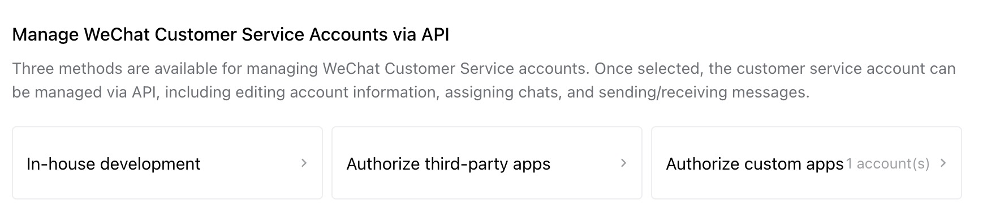

# WECHATY PUPPET WXKF
A wechaty puppet for Wechat Customer Service, or WXKF (Weixin Ke Fu).

[中文](./README-CHN.md)

[](https://badge.fury.io/js/wechaty-puppet-wxkf)

[](https://github.com/wechaty/wechaty)
[](https://www.typescriptlang.org/)


## How to use

### Install dependencies

```shell
npm install wechaty
npm install wechaty-puppet-wxkf
```

Note: wechaty-puppet-wxkf cannot run with wechaty < 1.0

### Set up Env or PuppetOptions

Unlike most of other wechaty puppet, wechaty-puppet-wxkf cannot login by scanning QRcode. You have to set up via ENV or PuppetOptions. If both were set for the same field, PuppetOptions will take priority.

This will be further discussed in later sections.

### Start ding-dong bot

```ts
import { WechatyBuilder  } from "wechaty";
import { PuppetWxkf } from "wechaty-puppet-wxkf";

const bot = WechatyBuilder.build({
  puppet: new PuppetWxkf()
})

bot.on('message', async message => {
  if (message.text === 'ding') {
    await message.say('dong')
  }
})

bot.start()
```

## Authentication

### How to get your keys

You may notice that we did not listen to 'scan' event when creating the ding-dong bot example. This is not a mistake.

The authentication for WXKF is done by 'WeChat Customer Service
' app of Wecom Company Ecosystem. You can manage apps in your Wecom company backend.


Pull down to the bottom of this pages, you can see Wechat Customer Service can be managed by APIs in 3 methods, In-house development, Authorize third-party apps or Authorize custom apps. So far wechaty-puppet-wxkf supports In-house development or Authorize custom apps.



If you want to manage a new WXKF account, here's what you gonna do.

- Create a new Customer Service Account in the Wechat Customer Service app page. Give it a `name` and avatar.

  Note: You can use `name` or `kfId` to identify your Wechat Customer Service account. However you cannot get ID in this webpage but only in apis. So if you want to identify by name, remember to give unique names to your 

- Get your `token` and `encodingAESKey`. These keys will be used to decrypt callbacks from wecom so you can receive messages.

  If you are developing In-house development app, you can find in the WeChat Customer Service app page, click API and then settings.

  

  If you are developing Authorize custom apps, you should find these keys in your custom app page.

- Setup callback url. You can put this puppet in a server and set the url to this puppet, however that is not recommended. In that case you can only manage one Wechat Customer Service account. You should setup a service to dispense these messages based on ID. You can use this project, [wxkf-manager](https://github.com/juzibot/wxkf-manager), or you can always build your own service.

- Get your `secret` and `corpId`. These keys will be used when sending messages.

  If you are developing In-house development app, you can click the 'view' button in above image, and the secret will be sent to your mobile wecom app. Your CorpId, or Company Id, can be found in the 'My Company' tab of wecom admin backend.

  If you are developing Authorize custom apps, these info will be sent to your callback service when the user install your app. Please dig into [Tencent official API references](https://developer.work.weixin.qq.com/document/path/97163) for further information. (Seems there is only Chinese version available.)

- You should also assign a `port`, a web server will listen to this port for callbacks.

### How to setup keys

- Via PuppetOptions

  ```ts
  const bot = WechatyBuilder.build({
    puppet: new PuppetWxkf({
      callbackPort: `${port}`,
      wxkfAuth: {
        token: `${token}`,
        encodingAESKey: `${encodingAESKey}`,
        corpId: `${corpId}`,
        corpSecret: `${secret}`,
        kfOpenId: `${kfId}`, // either of these two keys
        kfName: `${kfName}`, // is good enough
      },
    })
  })
  ```

- Via Environment Variable

  ```bash
  export PUPPET_WXKF_WECOM_APP_TOKEN=${token}
  export PUPPET_WXKF_WECOM_APP_AES_KEY=${encodingAESKey}
  export PUPPET_WXKF_WECOM_CORP_ID=${corpId}
  export PUPPET_WXKF_WECOM_CORP_SECRET=${secret}

  export PUPPET_WXKF_WECOM_KF_NAME=${name}
  export PUPPET_WXKF_WECOM_KF_OPEN_ID=${kfId}
  export PUPPET_WXKF_CALLBACK_PORT=8080
  ```

### Setup OSS

OSS(Object Storage Service) is an optional configuration for wechaty-puppet-wxkf. You can still use most of the features, but the ability of receiving Mini Programs will be impacted.

Here's the Mini Program payload of wechaty puppet:

```ts
export interface MiniProgramPayload {
    appid?       : string,   // optional, appid, get from wechat (mp.weixin.qq.com)
    description? : string,   // optional, mini program title
    pagePath?    : string,   // optional, mini program page path
    iconUrl?     : string,   // optional, mini program icon url
    shareId?     : string,   // optional, the unique userId for who share this mini program
    thumbUrl?    : string,   // optional, default picture, convert to thumbnail
    title?       : string,   // optional, mini program title
    username?    : string,   // original ID, get from wechat (mp.weixin.qq.com)
    thumbKey?    : string,   // original, thumbnailurl and thumbkey will make the headphoto of mini-program better
}
```

Note that icon and thumbnail are passed as url, instead of a filebox json string. For other payloads like message image and message file, we can pass a filebox of local file when we don't have any OSS files configured. However that is not the case for mini programs.

Wecom will give us direct url to link thumbnails, so link messages is fine.

The OSS we support so far includes S3, Ali, Minio, Tos and Cos. Please look into `src/util/env.ts` to find more info. Detailed document may be appended later.
